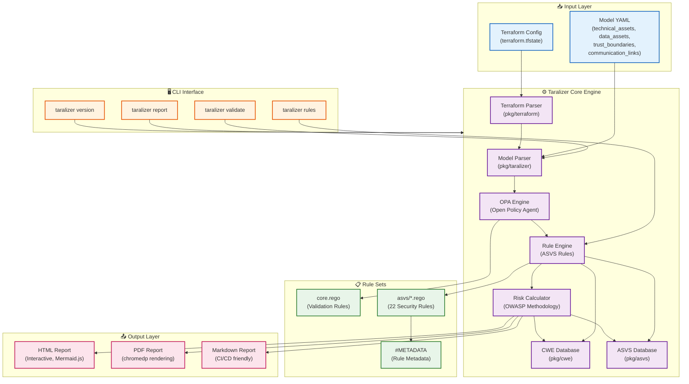

# Taralizer — Threat & Risk Analyzer for Cloud Architecture

<div align="center">

[](LICENSE)
[](https://goreportcard.com/report/github.com/devmatic-it/taralizer)
[](https://pkg.go.dev/github.com/devmatic-it/taralizer)
[](https://github.com/devmatic-it/taralizer/releases)
[](https://github.com/devmatic-it/taralizer/releases)
[](https://github.com/devmatic-it/taralizer/stargazers)
[](https://github.com/devmatic-it/taralizer/issues)
[](https://go.dev/)
[](https://www.openpolicyagent.org)

**Automated threat modeling and risk analysis for cloud architectures.**

[Get Started](#quick-start) · [Examples](#examples) · [Documentation](#documentation) · [Contributing](#contributing)

</div>

---

## What is Taralizer?

Taralizer is a **Threat and Risk Analysis** tool that evaluates cloud architecture models against industry security standards. It transforms a simple YAML architecture model into comprehensive security reports with actionable findings.

Built by security practitioners for security practitioners, Taralizer fills the gap between lightweight threat modeling and heavy enterprise tools. It integrates seamlessly into CI/CD pipelines, supports custom security profiles, and produces stakeholder-ready reports.

### Key Capabilities

- **OWASP ASVS Compliance** — 22 security rules covering authentication, authorization, encryption, injection, and more
- **MITRE CWE Integration** — Classify findings using the Common Weakness Enumeration database
- **Three Report Formats** — HTML (interactive), PDF (print-ready), Markdown (GitHub/GitLab native)
- **Custom Rules** — Extensible via Open Policy Agent (OPA) Rego rules
- **Zero External Dependencies** — HTML reports render diagrams inline via mermaid.js; PDF uses headless Chrome

---

## Quick Start

### Prerequisites

- Go 1.27+ (for building from source)
- Chrome or Chromium (for PDF report generation)

### Installation

#### Option 1: Download Pre-built Binary (Recommended)

```bash
# Download the latest release for your platform
# macOS (Intel)
curl -L https://github.com/devmatic-it/taralizer/releases/latest/download/taralizer_darwin_amd64.zip -o taralizer.zip
unzip taralizer.zip

# macOS (Apple Silicon)
curl -L https://github.com/devmatic-it/taralizer/releases/latest/download/taralizer_darwin_arm64.zip -o taralizer.zip
unzip taralizer.zip

# Linux
curl -L https://github.com/devmatic-it/taralizer/releases/latest/download/taralizer_linux_amd64.zip -o taralizer.zip
unzip taralizer.zip

# Windows
curl -L https://github.com/devmatic-it/taralizer/releases/latest/download/taralizer_windows_amd64.zip -o taralizer.zip
tar -xzf taralizer.zip
```

Add to your PATH and verify:

```bash
./taralizer version
```

#### Option 2: Install from Source

```bash
go install github.com/devmatic-it/taralizer@latest
```

Or build from repository:

```bash
git clone https://github.com/devmatic-it/taralizer.git
cd taralizer
make build
```

### First Report

Generate a security report from the Bank of Anthos example:

```bash
# HTML report (interactive, with inline diagrams)
./taralizer report examples/gcp/bank_of_anthos.yaml

# PDF report (print-ready)
./taralizer report examples/gcp/bank_of_anthos.yaml --type pdf

# Markdown report (renders in GitHub/GitLab/VS Code)
./taralizer report examples/gcp/bank_of_anthos.yaml --type markdown
```

Open `report.html` in your browser to see the full report with interactive diagrams.

---

## Features

### Security Standards

- **OWASP ASVS v4.0.2** — 22 rules covering:
  - Authentication & Session Management
  - Authorization & Access Control
  - Cryptography & Data Protection
  - Input Validation & Injection Protection
  - Security Misconfiguration
  - Logging & Monitoring

### Report Formats

| Format | Use Case | Diagrams |
|--------|----------|----------|
| **HTML** | Interactive review | Inline mermaid.js (CDN) |
| **PDF** | Print & distribution | Rendered by chromedp |
| **Markdown** | CI/CD, GitHub docs | Embedded mermaid code |

### Extensibility

- **Custom Rules** — Write Rego rules following OPA conventions
- **Custom Profiles** — Define technology mappings and trust boundaries
- **Custom Templates** — Customize report output with Go templates

---

## Architecture

### System Overview



### Component Details

| Component | Package | Responsibility |
|-----------|---------|----------------|
| **Model Parser** | `pkg/taralizer` | Parses YAML architecture models into internal representation |
| **OPA Engine** | `pkg/taralizer` | Loads and evaluates Rego policies against the model |
| **Rule Engine** | `rules/asvs/` | 22 ASVS-compliant security rules (missing-authentication, injection, etc.) |
| **Terraform Parser** | `pkg/terraform` | Parses Terraform state files to extract resource configurations |
| **CWE Database** | `pkg/cwe` | Maps findings to Common Weakness Enumeration IDs |
| **ASVS Database** | `pkg/asvs` | Maps findings to OWASP Application Security Verification Standard |
| **Risk Calculator** | `cmd/report.go` | Calculates risk severity using OWASP Risk Rating Methodology |
| **Report Generator** | `pkg/taralizer/reporting.go` | Generates HTML, PDF, and Markdown reports |

### Data Flow

1. **Input**: Architecture model (YAML) or Terraform state file
2. **Parse**: Model is parsed into structured data (technical assets, data assets, trust boundaries, communication links)
3. **Validate**: Core validation rules check model integrity
4. **Analyze**: 22 ASVS security rules evaluate the architecture against security best practices
5. **Calculate**: Risk severity is computed using OWASP methodology (Impact × Likelihood)
6. **Report**: Findings are rendered as interactive HTML, printable PDF, or Markdown

---

## Usage

### Commands

```bash
# Generate a report (default: HTML)
taralizer report <model.yaml> [--type html|pdf|markdown]

# List available rules
taralizer rules

# Validate a model
taralizer validate <model.yaml>

# Show version information
taralizer version
```

### Flags

| Flag | Description | Default |
|------|-------------|---------|
| `--ruleset` | Security standard to use | `asvs` |
| `--type` | Report format | `html` |
| `--config` | Configuration file path | `~/.taralizer/config.yaml` |

### Custom Rules

Create custom Rego rules in `~/.taralizer/rules/`:

```rego
# ~/.taralizer/rules/custom_policy.rego
package rules.custom

violation[{
    "id": sprintf("custom-rule@%v", [server.id]),
    "msg": sprintf("Custom finding: %v", [server.id]),
    "likelihood": 2,
    "impact": 3,
}] {
    server := input.technical_assets[_]
    server.technology == "web-application"
    # your custom logic here
}
```

### Custom Profiles

Define technology mappings in `~/.taralizer/profiles/`:

```yaml
# ~/.taralizer/profiles/custom.yaml
name: custom
description: Custom technology mappings
terraform_provider: "custom_provider"
technologies:
  - id: "my-service"
    name: "My Service"
    type: "technical_asset"
    terraform: "my_resource"
```

---

## Examples

### Bank of Anthos

The included Bank of Anthos example demonstrates a retail banking architecture with intentional security issues:

```bash
./taralizer report examples/gcp/bank_of_anthos.yaml
```

See the [Bank of Anthos README](examples/gcp/README.md) for details.

### Custom Model

Create your own architecture model:

```yaml
# my_architecture.yaml
technical_assets:
  - id: "web-app"
    name: "Web Application"
    technology: "kubernetes-pod"
    data_assets_processed:
      - "user-credentials"
    data_assets_stored:
      - "session-data"
    communication_links:
      - target: "database"
        protocol: "https"
        authentication: "mutual-tls"
trust_boundaries:
  - id: "internet"
    technical_assets_inside:
      - "web-app"
data_assets:
  - id: "user-credentials"
    confidentiality: 3
    integrity: 2
    availability: 1
```

---

## Contributing

We welcome contributions! Please see our [Contributing Guide](.github/CONTRIBUTING.md) for details.

### Development Setup

```bash
# Clone the repository
git clone https://github.com/devmatic-it/taralizer.git
cd taralizer

# Install dependencies
go mod download

# Run tests
make test

# Build the binary
make build

# Run linter
make lint
```

### Pull Request Process

1. Fork the repository
2. Create a feature branch (`git checkout -b feature/amazing-feature`)
3. Commit your changes (`git commit -m 'Add amazing feature'`)
4. Push to the branch (`git push origin feature/amazing-feature`)
5. Open a Pull Request

Please ensure:
- All tests pass (`make test`)
- Code is linted (`make lint`)
- New features include tests
- Documentation is updated

---

## Roadmap

- [ ] AWS, Azure, and GCP terraform provider support
- [ ] Interactive web UI for model editing
- [ ] Custom rule marketplace
- [ ] Integration with popular CI/CD platforms
- [ ] Export to Jira, ServiceNow, and other ticketing systems

---

## Credits

This project was inspired by and builds upon the following excellent open-source projects:

- **[Threagile](https://threagile.io)** — Agile Threat Modelling
- **[Open Policy Agent](https://www.openpolicyagent.org)** — Policy Engine
- **[chromedp](https://github.com/chromedp/chromedp)** — Headless Chrome Automation
- **[mermaid.js](https://mermaid.js.org)** — Diagram Rendering
- **[OWASP ASVS](https://owasp.org/www-project-application-security-verification-standard/)** — Application Security Verification Standard
- **[MITRE CWE](https://cwe.mitre.org)** — Common Weakness Enumeration

---

## License

This project is licensed under the [Apache License 2.0](LICENSE).

---

## Support

- **Documentation**: This README and inline documentation
- **Issues**: [GitHub Issues](https://github.com/devmatic-it/taralizer/issues)
- **Discussions**: [GitHub Discussions](https://github.com/devmatic-it/taralizer/discussions)

---

<div align="center">

**Built with ❤️ by the Taralizer team**

[Report a Bug](https://github.com/devmatic-it/taralizer/issues) · [Request Feature](https://github.com/devmatic-it/taralizer/issues) · [Ask a Question](https://github.com/devmatic-it/taralizer/discussions)

</div>
