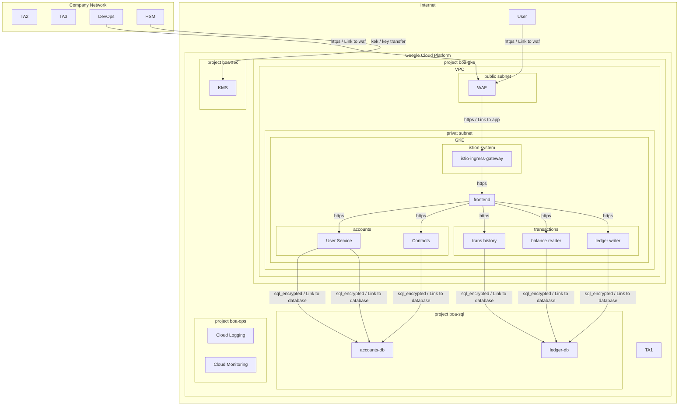

# Threat and Risk Analysis: Bank of Anthos

**Customer:** Anthos Bank Investment Ltd.
**Version:** 1.1
**Date:** 2020-07-02
**Author:** Ferenc Bator

---

## System Description

### Data Flow Diagram

### Trust Boundaries

| Name | Technology | Description |
|------|------------|-------------|
| Internet | internet | Internet |
| Google Cloud Platform | internet | Google Cloud |
| project boa-gke | project | Google Project |
| VPC | vpc | Virtual Private Cloud |
| public subnet | subnet | internet facing zone |
| privat subnet | subnet | Application Network |
| GKE | kubernetes-cluster | kubernetes cluster |
| frontend | kubernetes-network-policies | kubernetes frontend namespace |
| accounts | kubernetes-network-policies | kubernetes default namespace |
| transactions | kubernetes-network-policies | kubernetes default namespace |
| istion-system | kubernetes-network-policies | kubernetes istio-system |
| project boa-sql | cloud-services | Azure Shared Services |
| project boa-sec | project | Contains Secret Manager and KMS instances for secrets that are specific to the Bank of Anthos application. |
| project boa-ops | project | Used for storing environment logs as well as monitoring the environment instance of the Bank of Anthos application. |
| Company Network | on-premise | trusted on-premise company network |

### Technical Assets

| Name | Technology | Description |
|------|------------|-------------|
| User | browser | The browser used by the end customer |
| DevOps | devops-client | laptop used by developers and operators to manage the system |
| WAF | waf | Google Cloud Armor Web Application Firewall |
| istio-ingress-gateway | kubernetes-ingress | ISTIO ingress gateway |
| frontend | kubernetes-pod | Exposes an HTTP server to serve the website. Contains a login page, a signup page, and a home page. |
| User Service | kubernetes-pod |  |
| Contacts | kubernetes-pod | Stores a list of additional accounts that are associated with a user. These accounts are listed in the application's Send Payment and Deposit forms. |
| User Service | kubernetes-pod | Manages user accounts and authentication. The service signs JWTs that are used for authentication by other services. |
| accounts-db | database-sql | SQL database |
| ledger writer | kubernetes-pod | Accepts and validates incoming transactions before writing them to the ledger. |
| balance reader | kubernetes-pod | Provides an efficient readable cache of user balances, as read from ledger-db. |
| trans history | kubernetes-pod | Provides an efficient readable cache of past transactions, as read from ledger-db. |
| ledger-db | database-nosql | CloudSQL for hyperledger |
| KMS | hsm | Google Key Management Service |
| HSM | hsm | on-premise Harware Security Module (HSM) |
| Cloud Logging | logging | Cloud Monitoring |
| Cloud Monitoring | monitoring | KMS |

---

## Problem Description

### Data Assets

| Name | Description | C | I | A |
|------|-------------|---|---|---|
| A1 | Angular and other client-side code delivered by the application. | 1 | 1 | 1 |
| A2 | OIDC identity token | 2 | 1 | 1 |
| A3 | OAuth2 access token | 2 | 1 | 1 |
| A4 | OAuth2 refresh token | 2 | 1 | 1 |
| A5 | active/ongoing bank transactions | 3 | 2 | 2 |
| A6 | bank transaction history | 3 | 2 | 2 |
| A7 | account balance of client | 3 | 2 | 2 |
| A8 | root certificates | 3 | 2 | 2 |
| A9 | Session ID | 2 | 2 | 2 |
| A10 | personal-related end user information like e-mail to identity user |  |  |  |
| A11 | passwort of a user | 3 | 2 | 2 |
| A12 | contacts of the customer from past transactions | 2 | 2 | 2 |
| A13 | credentials to access ledger db | 3 | 2 | 2 |
| A14 | credentials to access ledger db | 3 | 2 | 2 |

### Threat Agents

| Name | Description |
|------|-------------|
| TA1 | external threat agent |
| TA2 | authorized employee |
| TA3 | Employee/Contractor of the company that is not authorized to access the system |

---

## Risk Assessment

### Risk Matrix

We follow the [OWASP Risk Rating Methodology](https://owasp.org/www-community/OWASP_Risk_Rating_Methodology).

| Likelihood → Impact ↓ | LOW | MEDIUM | HIGH |
|--------------------------|-----|--------|------|
| **LOW** | Low | Low | Medium |
| **MEDIUM** | Low | Medium | High |
| **HIGH** | Medium | High | Critical |

### Identified Risks

| ID | Likelihood | Impact | Severity | Risk |
|----|------------|--------|----------|------|
| container-baseimage-backdooring@balance_reader | LOW(1) | MEDIUM(2) | LOW(2) | [CWE-912](https://cheatsheetseries.owasp.org/cheatsheets/Docker_Security_Cheat_Sheet.html) **Container Base Image Backdooring**: asset 'balance_reader' has risk of container image backdooring through base images  When a technical asset is built using container technologies, Base Image Backdooring risks might arise where base images and other layers used contain vulnerable components or backdoors
 **Mitigation:** Google distroless image is used to mitigate risks.  
The product owner accepted the residual risks.

 |
| container-baseimage-backdooring@contacts | LOW(1) | MEDIUM(2) | LOW(2) | [CWE-912](https://cheatsheetseries.owasp.org/cheatsheets/Docker_Security_Cheat_Sheet.html) **Container Base Image Backdooring**: asset 'contacts' has risk of container image backdooring through base images  When a technical asset is built using container technologies, Base Image Backdooring risks might arise where base images and other layers used contain vulnerable components or backdoors
 **Mitigation:** Google distroless image is used to mitigate risks.  
The product owner accepted the residual risks.

 |
| container-baseimage-backdooring@frontend | LOW(1) | MEDIUM(2) | LOW(2) | [CWE-912](https://cheatsheetseries.owasp.org/cheatsheets/Docker_Security_Cheat_Sheet.html) **Container Base Image Backdooring**: asset 'frontend' has risk of container image backdooring through base images  When a technical asset is built using container technologies, Base Image Backdooring risks might arise where base images and other layers used contain vulnerable components or backdoors
 **Mitigation:** Google distroless image is used to mitigate risks.  
The product owner accepted the residual risks.

 |
| container-baseimage-backdooring@ledger_writer | LOW(1) | MEDIUM(2) | LOW(2) | [CWE-912](https://cheatsheetseries.owasp.org/cheatsheets/Docker_Security_Cheat_Sheet.html) **Container Base Image Backdooring**: asset 'ledger_writer' has risk of container image backdooring through base images  When a technical asset is built using container technologies, Base Image Backdooring risks might arise where base images and other layers used contain vulnerable components or backdoors
 **Mitigation:** Google distroless image is used to mitigate risks.  
The product owner accepted the residual risks.

 |
| container-baseimage-backdooring@trans_history | LOW(1) | MEDIUM(2) | LOW(2) | [CWE-912](https://cheatsheetseries.owasp.org/cheatsheets/Docker_Security_Cheat_Sheet.html) **Container Base Image Backdooring**: asset 'trans_history' has risk of container image backdooring through base images  When a technical asset is built using container technologies, Base Image Backdooring risks might arise where base images and other layers used contain vulnerable components or backdoors
 **Mitigation:** Google distroless image is used to mitigate risks.  
The product owner accepted the residual risks.

 |
| container-baseimage-backdooring@user_service | LOW(1) | MEDIUM(2) | LOW(2) | [CWE-912](https://cheatsheetseries.owasp.org/cheatsheets/Docker_Security_Cheat_Sheet.html) **Container Base Image Backdooring**: asset 'user_service' has risk of container image backdooring through base images  When a technical asset is built using container technologies, Base Image Backdooring risks might arise where base images and other layers used contain vulnerable components or backdoors
 **Mitigation:** Google distroless image is used to mitigate risks.  
The product owner accepted the residual risks.

 |
| cross-site-request-forgery@balance_reader | HIGH(3) | MEDIUM(2) | HIGH(6) | [CWE-352](https://cheatsheetseries.owasp.org/cheatsheets/Cross-Site_Request_Forgery_Prevention_Cheat_Sheet.html) **Cross-Site Request Forgery (CSRF)**: asset 'balance_reader' has risk of Cross Site Request Forgery(CSRF)  When a web application is accessed via web protocols Cross-Site Request Forgery (CSRF) risks might arise. **Mitigation:** Try to use anti-CSRF tokens ot the double-submit patterns (at least for logged-in requests). When your authentication scheme depends on cookies (like session or token cookies), consider marking them with the same-site flag. When a third-party product is used instead of custom developed software, check if the product applies the proper mitigation and ensure a reasonable patch-level
 |
| cross-site-request-forgery@contacts | HIGH(3) | MEDIUM(2) | HIGH(6) | [CWE-352](https://cheatsheetseries.owasp.org/cheatsheets/Cross-Site_Request_Forgery_Prevention_Cheat_Sheet.html) **Cross-Site Request Forgery (CSRF)**: asset 'contacts' has risk of Cross Site Request Forgery(CSRF)  When a web application is accessed via web protocols Cross-Site Request Forgery (CSRF) risks might arise. **Mitigation:** Try to use anti-CSRF tokens ot the double-submit patterns (at least for logged-in requests). When your authentication scheme depends on cookies (like session or token cookies), consider marking them with the same-site flag. When a third-party product is used instead of custom developed software, check if the product applies the proper mitigation and ensure a reasonable patch-level
 |
| cross-site-request-forgery@frontend | HIGH(3) | MEDIUM(2) | HIGH(6) | [CWE-352](https://cheatsheetseries.owasp.org/cheatsheets/Cross-Site_Request_Forgery_Prevention_Cheat_Sheet.html) **Cross-Site Request Forgery (CSRF)**: asset 'frontend' has risk of Cross Site Request Forgery(CSRF)  When a web application is accessed via web protocols Cross-Site Request Forgery (CSRF) risks might arise. **Mitigation:** Try to use anti-CSRF tokens ot the double-submit patterns (at least for logged-in requests). When your authentication scheme depends on cookies (like session or token cookies), consider marking them with the same-site flag. When a third-party product is used instead of custom developed software, check if the product applies the proper mitigation and ensure a reasonable patch-level
 |
| cross-site-request-forgery@ledger_writer | HIGH(3) | MEDIUM(2) | HIGH(6) | [CWE-352](https://cheatsheetseries.owasp.org/cheatsheets/Cross-Site_Request_Forgery_Prevention_Cheat_Sheet.html) **Cross-Site Request Forgery (CSRF)**: asset 'ledger_writer' has risk of Cross Site Request Forgery(CSRF)  When a web application is accessed via web protocols Cross-Site Request Forgery (CSRF) risks might arise. **Mitigation:** Try to use anti-CSRF tokens ot the double-submit patterns (at least for logged-in requests). When your authentication scheme depends on cookies (like session or token cookies), consider marking them with the same-site flag. When a third-party product is used instead of custom developed software, check if the product applies the proper mitigation and ensure a reasonable patch-level
 |
| cross-site-request-forgery@trans_history | HIGH(3) | MEDIUM(2) | HIGH(6) | [CWE-352](https://cheatsheetseries.owasp.org/cheatsheets/Cross-Site_Request_Forgery_Prevention_Cheat_Sheet.html) **Cross-Site Request Forgery (CSRF)**: asset 'trans_history' has risk of Cross Site Request Forgery(CSRF)  When a web application is accessed via web protocols Cross-Site Request Forgery (CSRF) risks might arise. **Mitigation:** Try to use anti-CSRF tokens ot the double-submit patterns (at least for logged-in requests). When your authentication scheme depends on cookies (like session or token cookies), consider marking them with the same-site flag. When a third-party product is used instead of custom developed software, check if the product applies the proper mitigation and ensure a reasonable patch-level
 |
| cross-site-request-forgery@user_service | HIGH(3) | MEDIUM(2) | HIGH(6) | [CWE-352](https://cheatsheetseries.owasp.org/cheatsheets/Cross-Site_Request_Forgery_Prevention_Cheat_Sheet.html) **Cross-Site Request Forgery (CSRF)**: asset 'user_service' has risk of Cross Site Request Forgery(CSRF)  When a web application is accessed via web protocols Cross-Site Request Forgery (CSRF) risks might arise. **Mitigation:** Try to use anti-CSRF tokens ot the double-submit patterns (at least for logged-in requests). When your authentication scheme depends on cookies (like session or token cookies), consider marking them with the same-site flag. When a third-party product is used instead of custom developed software, check if the product applies the proper mitigation and ensure a reasonable patch-level
 |

---

## Methodology

### STRIDE

- **S**poofing — Impersonating another entity
- **T**ampering — Modifying data or code
- **R**epudiation — Denying actions occurred
- **I**nformation Disclosure — Leaking data
- **D**enial of Service — Disrupting availability
- **E**levation of Privilege — Gaining unauthorized access

### Likelihood Scale

| Score | Level |
|-------|-------|
| 0 | NONE |
| 1 | LOW |
| 2 | MEDIUM |
| 3 | HIGH |
| ≥4 | VERY HIGH |

### Impact Scale

| Score | Level |
|-------|-------|
| 1 | LOW |
| 2 | MEDIUM |
| 3 | HIGH |
| 6 | HIGH |
| 9 | CRITICAL |

---

## About Taralizer

### Risk Rules: OWASP Application Security Verification Standard — 4.0.2

The OWASP Application Security Verification Standard is specified [here](https://github.com/OWASP/ASVS/raw/v4.0.2/4.0/OWASP%20Application%20Security%20Verification%20Standard%204.0.2-en.pdf).

#### Rule missing-authentication

- **Title:** Missing Authentication
- **Description:** Technical assets should autheticate incoming requests. 
- **CWE:** [306](https://cwe.mitre.org/data/definitions/306)
- **Mitigation:** apply an authentication method to the technical asset.
- **URL:** [https://cheatsheetseries.owasp.org/cheatsheets/Transport_Layer_Protection_Cheat_Sheet.html](https://cheatsheetseries.owasp.org/cheatsheets/Transport_Layer_Protection_Cheat_Sheet.html)
- **Base Likelihood:** HIGH(3)
- **Base Impact:** MEDIUM(2)

#### Rule insecure-proto

- **Title:** Unencrypted Communication
- **Description:** Data at transition should be encrypted. 
- **CWE:** [319](https://cwe.mitre.org/data/definitions/319)
- **Mitigation:** apply an authentication method to the technical asset.
- **URL:** [https://cheatsheetseries.owasp.org/cheatsheets/Transport_Layer_Protection_Cheat_Sheet.html](https://cheatsheetseries.owasp.org/cheatsheets/Transport_Layer_Protection_Cheat_Sheet.html)
- **Base Likelihood:** HIGH(3)
- **Base Impact:** MEDIUM(2)

#### Rule missing-vault

- **Title:** Missing Vault (Secret Storage)
- **Description:** In order to avoid the risk of secret leakage via config files (when attacked through vulnerabilities being able to read files like Path-Traversal and others), it is best practice to use a separate hardened process with proper authentication authorization, and audit logging to access config secrets (like credentials, private keys, client certificates, etc.). This component is usually some kind of Vault.

- **CWE:** [522](https://cwe.mitre.org/data/definitions/522)
- **Mitigation:** Consider using a Vault (Secret Storage) to securely store and access config secrets (like credentials, private keys, client certificates, etc.)
- **URL:** [https://cheatsheetseries.owasp.org/cheatsheets/Cryptographic_Storage_Cheat_Sheet.html](https://cheatsheetseries.owasp.org/cheatsheets/Cryptographic_Storage_Cheat_Sheet.html)
- **Base Likelihood:** LOW(1)
- **Base Impact:** LOW(1)

#### Rule missing-waf

- **Title:** Missing Web Application Firewall (WAF)
- **Description:** To have a first line of filtering defense, security architectures with web-services or web-applications should include a WAF in front of them. Even though a WAF is not a replacement for security (all components must be secure even without a WAF) it adds another layer of defense to the overall system by delaying some attacks and having easier attack alerting through it

- **CWE:** [1008](https://cwe.mitre.org/data/definitions/1008)
- **Mitigation:** Consider placing a fully-managed Web Application Firewall (WAF) in front of the web-services and/or web-applications
- **URL:** [https://cheatsheetseries.owasp.org/cheatsheets/Virtual_Patching_Cheat_Sheet.html](https://cheatsheetseries.owasp.org/cheatsheets/Virtual_Patching_Cheat_Sheet.html)
- **Base Likelihood:** LOW(1)
- **Base Impact:** LOW(1)

#### Rule cross-site-scripting

- **Title:** Cross-Site Scripting (XSS)
- **Description:** For each web application Cross-Site Scripting (XSS) risks might arise. In terms of the overall risk level take other applications running on the same domain into account as well.

- **CWE:** [79](https://cwe.mitre.org/data/definitions/79)
- **Mitigation:** Try to encode all values sent back to the browser and also handle DOM-manipulations in a safe way to avoid DOM-based XSS. When a third-party product is used instead of custom developed software,  check if the product applies the proper mitigation and ensure a reasonable patch-level.

- **URL:** [https://cheatsheetseries.owasp.org/cheatsheets/Cross_Site_Scripting_Prevention_Cheat_Sheet.html](https://cheatsheetseries.owasp.org/cheatsheets/Cross_Site_Scripting_Prevention_Cheat_Sheet.html)
- **Base Likelihood:** MEDIUM(2)
- **Base Impact:** MEDIUM(2)

#### Rule container-baseimage-backdooring

- **Title:** Container Base Image Backdooring
- **Description:** When a technical asset is built using container technologies, Base Image Backdooring risks might arise where base images and other layers used contain vulnerable components or backdoors

- **CWE:** [912](https://cwe.mitre.org/data/definitions/912)
- **Mitigation:** Apply hardening of all container infrastructures (see for example the CIS-Benchmarks for Docker and Kubernetes and the Docker Bench for Security Use only trusted base images of the original vendors, verify digital signatures and apply image creation best practices. Also consider using Google's Distroless base images or otherwise very small base images. Regularly execute container image scans with tools checking the layers for vulnerable components.

- **URL:** [https://cheatsheetseries.owasp.org/cheatsheets/Docker_Security_Cheat_Sheet.html](https://cheatsheetseries.owasp.org/cheatsheets/Docker_Security_Cheat_Sheet.html)
- **Base Likelihood:** MEDIUM(2)
- **Base Impact:** MEDIUM(2)

#### Rule cross-site-request-forgery

- **Title:** Cross-Site Request Forgery (CSRF)
- **Description:** When a web application is accessed via web protocols Cross-Site Request Forgery (CSRF) risks might arise.
- **CWE:** [352](https://cwe.mitre.org/data/definitions/352)
- **Mitigation:** Try to use anti-CSRF tokens ot the double-submit patterns (at least for logged-in requests). When your authentication scheme depends on cookies (like session or token cookies), consider marking them with the same-site flag. When a third-party product is used instead of custom developed software, check if the product applies the proper mitigation and ensure a reasonable patch-level

- **URL:** [https://cheatsheetseries.owasp.org/cheatsheets/Cross-Site_Request_Forgery_Prevention_Cheat_Sheet.html](https://cheatsheetseries.owasp.org/cheatsheets/Cross-Site_Request_Forgery_Prevention_Cheat_Sheet.html)
- **Base Likelihood:** HIGH(3)
- **Base Impact:** LOW(1)

### Disclaimer

Ferenc Bator conducted this threat analysis using the open-source TARALIZER toolkit on the applications and systems that were modeled as of this report's date. Information security threats are continually changing, with new vulnerabilities discovered on a daily basis, and no application can ever be 100% secure no matter how much threat modeling is conducted. It is recommended to execute threat modeling and also penetration testing on a regular basis (for example yearly) to ensure a high ongoing level of security and constantly check for new attack vectors.

This report cannot and does not protect against personal or business loss as the result of use of the applications or systems described. Ferenc Bator and the TARALIZER toolkit offers no warranties, representations or legal certifications concerning the applications or systems it tests. All software includes defects: nothing in this document is intended to represent or warrant that threat modeling was complete and without error, nor does this document represent or warrant that the architecture analyzed is suitable to task, free of other defects than reported, fully compliant with any industry standards, or fully compatible with any operating system, hardware, or other application.

Threat modeling tries to analyze the modeled architecture without having access to a real working system and thus cannot and does not test the implementation for defects and vulnerabilities. These kinds of checks would only be possible with a separate code review and penetration test against a working system and not via a threat model.

By using the resulting information you agree that Ferenc Bator and the TARALIZER toolkit shall be held harmless in any event.

This report is confidential and intended for internal, confidential use by the client. The recipient is obligated to ensure the highly confidential contents are kept secret. The recipient assumes responsibility for further distribution of this document.

In this particular project, a timebox approach was used to define the analysis effort. This means that the author allotted a prearranged amount of time to identify and document threats. Because of this, there is no guarantee that all possible threats and risks are discovered. Furthermore, the analysis applies to a snapshot of the current state of the modeled architecture (based on the architecture information provided by the customer) at the examination time.

### Report Distribution

Distribution of this report (in full or in part like diagrams or risk findings) requires that this disclaimer as well as the chapter about the TARALIZER toolkit and method used is kept intact as part of the distributed report or referenced from the distributed parts.
